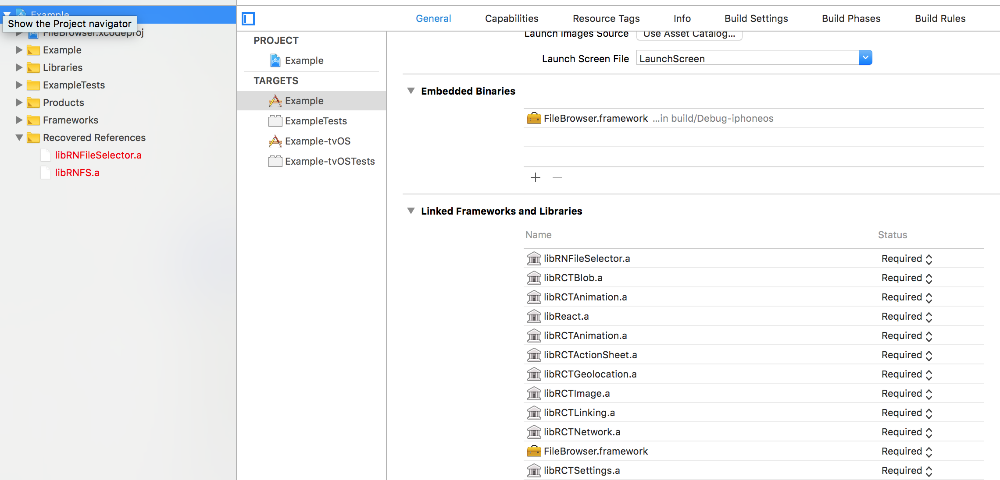

# React Native: Native File Selector (Android & iOS)

<p align="center">
  <a href="https://www.npmjs.com/package/react-native-file-selector"></a>
  <a href="https://github.com/prscX/react-native-file-selector/pulls"></a>
  <a href="https://github.com/prscX/react-native-file-selector#License"></a>
</p>

This library is a ReactNative Bridge around native [nbsp-team/MaterialFilePicker/](https://github.com/nbsp-team/MaterialFilePicker) & [marmelroy/FileBrowser](https://github.com/marmelroy/FileBrowser) file picker. It allows you to natively select/pick file from device file system. 


| **Android: [nbsp-team/MaterialFilePicker/](https://github.com/nbsp-team/MaterialFilePicker)**             |
| ----------------- |
|                   |


> **Note**: It allows you to pick file without using Intent/Third Party Software

| **iOS: [marmelroy/FileBrowser](https://github.com/marmelroy/FileBrowser)**             |
| ----------------- |
|                   |


> **Note**: It allows you to select only local files associate to app sandbox.


## Getting started
`$ npm install react-native-file-selector --save`

`$ react-native link react-native-file-selector`

#### **Android**

- Add below snippet in your app `build.gradle` file

```
repositories {
    maven {
        url  "http://dl.bintray.com/lukaville/maven"
    }
    google()
    ...
}

allprojects {
    repositories {
        mavenLocal()
        jcenter()
        google()
        ...
    }
}
```

> **Note:** This library is supported Android 27 > above


- Add below color attributes in your app `res/color.xml`. You can provide your own color codes

```
    <color name="colorPrimary">#3F51B5</color>
    <color name="colorPrimaryDark">#303F9F</color>
    <color name="colorAccent">#FF4081</color>
```

> **Note**: Android library works `compileSdkVersion > 25`

#### **iOS**

- Add below snippet in your app `AppDelegate.m`. This basically adds navigation controller in order to push list of files screen

```
  UINavigationController *navigationController = [[UINavigationController alloc] initWithRootViewController:rootViewController];
  navigationController.navigationBar.hidden = YES;

  self.window.rootViewController = navigationController;

//  self.window.rootViewController = rootViewController;

```

- Add `FileBrowser` in Embedded Binaries & Linked Frameworks and Libraries. You can find this library from below path:

`node_modules/react-native-file-selector/ios/FileBrowser/FileBrowser.xcodeproj`



- 

## Usage

`import RNFileSelector from 'react-native-file-selector';`

- API Way

```javascript
RNFileSelector.Show(
    {
        title: 'Select File',
        onDone: (path) => {
            console.log('file selected: ' + path)
        },
        onCancel: () => {
            console.log('cancelled')
        }
    }
)
```

- React Way

```javascript
<RNFileSelector title={"Select File"} visible={this.state.visible} onDone={() => {
    console.log("file selected: " + path);
}} onCancel={() => {
    console.log("cancelled");
}}/>
```


## Props


| Prop              | Type       | Default | Note                                                                                                       |
| ----------------- | ---------- | ------- | ---------------------------------------------------------------------------------------------------------- |
| `title`       | `string`     |         | Title on the toolbar
| `closeMenu`      | `string`     |   true      | Color of tint
| `hiddenFiles: Android`       | `bool`     |  false       | If true it shows hidden files as well                                                            |
| `path` | `string` |         | Path of directory                                                   |  |
| `filter`    | `string`     |         | Filter to sort the files                                        |  |
| `filterDirectories: Android`      | `bool`     |         | Filter should be applied on directories or not 
| `onDone`      | `func`     |         | Function called when file is selected       |  |
| `onCancel`      | `func`     |         | Function called when file selector is closed without selecting any file | |
| `visible`      | `bool`     |    false     | To invoke file selector | |


> **Note**
> - **Filter**
>    - **Android:** Please find [regex/Pattern](https://developer.android.com/reference/java/util/regex/Pattern.html) for defining filter
>    - **iOS:** Array of file extension needs to be ignore


## Credits

- Android: [nbsp-team/MaterialFilePicker/](https://github.com/nbsp-team/MaterialFilePicker)
- iOS: [marmelroy/FileBrowser](https://github.com/marmelroy/FileBrowser)

## Contribution
Contributions are welcome and are greatly appreciated! Every little bit helps, and credit will always be given.

## License
This library is provided under the MIT License.

RNFileSelector @ Pranav Raj Singh Chauhan


## Other Contributions

| [awesome-react-native-native-modules](https://github.com/prscX/awesome-react-native-native-modules)              |
| ----------------- |
|                   |


| [react-native-spruce](https://github.com/prscX/react-native-spruce)              |
| ----------------- |
|                   |


| [react-native-taptargetview](https://github.com/prscX/react-native-taptargetview) & [react-native-material-showcase-ios](https://github.com/prscX/react-native-material-showcase-ios)              |
| ----------------- |
|   |


| [react-native-bottom-action-sheet](https://github.com/prscX/react-native-bottom-action-sheet)              |
| ----------------- |
|                   |


| [react-native-popover-menu](https://github.com/prscX/react-native-popover-menu)             |
| ----------------- |
|                   |


| [react-native-tooltips](https://github.com/prscX/react-native-tooltips)             |
| ----------------- |
|                   |


| [react-native-shine-button](https://github.com/prscX/react-native-shine-button)             |
| ----------------- |
|                   |


| [react-native-iconic](https://github.com/prscX/react-native-iconic)             |
| ----------------- |
|                   |


| [react-native-download-button](https://github.com/prscX/react-native-download-button)             |
| ----------------- |
|                   |


| [react-native-siri-wave-view](https://github.com/prscX/react-native-siri-wave-view)             |
| ----------------- |
|                   |


|  [react-native-material-shadows](https://github.com/prscX/react-native-material-shadows)             |
| ----------------- |
|                   |


|  [react-native-gradient-blur-view](https://github.com/prscX/react-native-gradient-blur-view)             |
| ----------------- |
|                   |


|  [react-native-about-libraries](https://github.com/prscX/react-native-about-libraries)             |
| ----------------- |
|                   |


|  [vs-essential-plugins](https://github.com/prscX/vs-essential-plugins)             |
| ----------------- |
|                   |


|  [prettier-pack](https://github.com/prscX/prettier-pack)             |
| ----------------- |
|                   |
